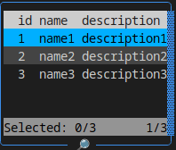

# cli-active-table

Is an npm package for Node.js CLI applications that provides interactive tables with keyboard navigation, live preview, and support for rendering multiple lists.

## Installation

To install the package, use the one of the following commands depending on you package manager:

```sh
npm install cli-active-table
```

```sh
yarn add cli-active-table
```

```sh
pnpm add cli-active-table
```

## Usage

### Basic usage

```typescript
const data = [
  { id: 1, name: 'name1', description: 'description1' },
  { id: 2, name: 'name2', description: 'description2' },
  { id: 3, name: 'name3', description: 'description3' },
];
const table = new ActiveTable([{ data }]);
const result = await table.handle();
console.log(result);
```



### More examples

[Multiple tables](./docs/examples/multiple.md)

[Validation](./docs/examples/validation.md)

[Render only specific fields](./docs/examples/fields.md)

[Sorting](./docs/examples/sorting.md)

### Use Сases


### Options

| Option      | Description                                     | Default   |
| ----------- | ----------------------------------------------- | --------- |
| `--border`  | Enables table border                            | `true`    |
| `--compact` | Removes padding between rows                    | `false`   |
| `--width`   | Sets table width (auto, fixed, etc.)            | `auto`    |
| `--align`   | Sets text alignment (left, center, right)       | `left`    |
| `--theme`   | Applies a predefined color theme                | `default` |
| `--preview` | Renders a table preview before applying changes | `false`   |

## Key bindings

| Component    | Key         | Description         |
| ------------ | ----------- | ------------------- |
| Any          | `Ctrl+C`    | Exit application    |
| Any          | `Tab`       | Rotate section      |
| Any          | `Shift+Tab` | Back rotate section |
| List Section | `Space`     | Select/Deselect row |
| List Section | `Ctrl+a`    | Select/Deselect all |
| List Section | `delete`    | Delete row          |
| List Section | `Ctrl+f`    | Enable search mode  |

## Contributing

Contributions are welcome! Please follow these steps:

1. Fork the repository.
2. Create a new branch for your feature or bug fix: `git checkout -b feature-name`
3. Commit your changes: `git commit -m "Description of changes"`
4. Push to the branch: `git push origin feature-name`
5. Submit a pull request.

License

This project is licensed under the MIT License. See the [LICENSE](./LICENSE) file for details.
