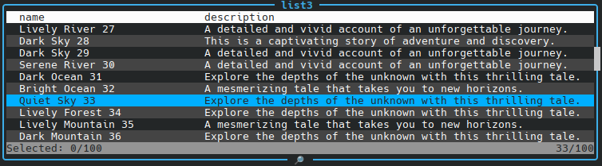

# cli-active-table

A lightweight JavaScript utility for rendering data in command line interface.

## Installation

To install the package, use the following command:

`TBD`

## Usage

```typescript
await new ActiveTable({
  data: list,
  primary: 'id',
  fields: ['name', 'description'],
  title: 'list3',
  lines: 10,
}).handle();
```

you get



## Contributing

Contributions are welcome! Please follow these steps:

1. Fork the repository.
2. Create a new branch for your feature or bug fix: `git checkout -b feature-name`
3. Commit your changes: `git commit -m "Description of changes"`
4. Push to the branch: `git push origin feature-name`
5. Submit a pull request.

License

This project is licensed under the MIT License. See the [LICENSE](./LICENSE) file for details.
