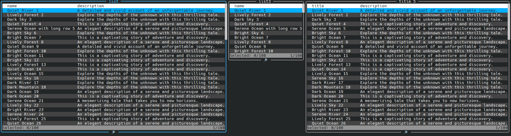

[Back](../../README.md)

### Multiple tables

```typescript
const result = await new ActiveTable([
  {
    data: list,
    fields: ['name', 'description'],
    title: 'list',
  },
  {
    data: list,
    fields: ['name'],
    title: 'list3',
  },
  {
    data: list2,
    fields: ['title', 'description'],
    title: 'title 5',
  },
]).handle();
```


