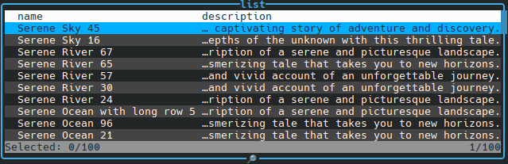

[Back](../../README.md)

### Sorting

```typescript
const result = await new ActiveTable([
  {
    data: list,
    fields: ['name', 'description'],
    sortBy: [{ key: 'name', direction: 'DESC' }],
    title: 'list',
  },
]).handle();
```


