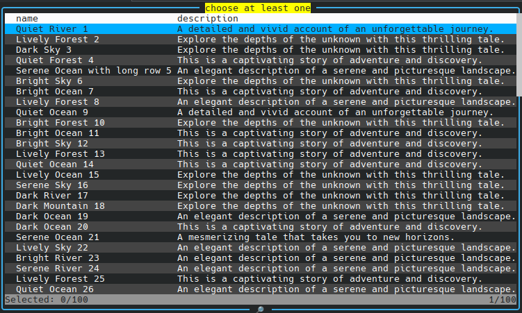

[Back](../../README.md)

### Validation

```typescript
const result = await new ActiveTable([
  {
    data: list,
    fields: ['name', 'description'],
    title: 'list',
    validate: (list, error) => {
      if (list.length > 0) {
        return true;
      }
      error.message = 'choose at least one';
      return false;
    },
  },
]).handle();
console.log(result);
```


